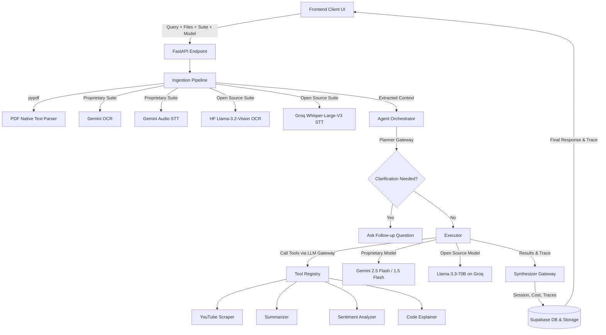

# Data Smith AI - Multi-Input Agentic Application

Data Smith AI is a production-grade, containerized agentic application that accepts multiple input types simultaneously (plain text, images, PDFs, audio recordings), extracts content, understands user intent, and plans and executes multi-step workflows.

It is decoupled from any single LLM provider, offering a dynamic **AI Engine Settings** panel in the UI to switch between proprietary and open-source models.

---

## System Architecture



---

## Supported Suites & Models

### 1. Proprietary Suite (Gemini)
- **OCR Engine:** Google Gemini Vision.
- **Audio Transcription:** Google Gemini Audio API.
- **Planner & Text Tools:** `gemini-2.5-flash` or `gemini-1.5-flash`.

### 2. Open Source Suite (Groq / Hugging Face)
- **OCR Engine:** `meta-llama/Llama-3.2-11B-Vision-Instruct` via the Hugging Face Serverless Inference API.
- **Audio Transcription:** `whisper-large-v3` running at sub-second speeds via the Groq API.
- **Planner & Text Tools:** Meta's `llama-3.3-70b-versatile` running via the Groq API.
- **Local RAG:** PDF text is parsed locally using `pypdf` and directly injected into the open-source context window without using proprietary APIs.

---

## Installation & Setup

Ensure you have **Python 3.10+** and [uv](https://github.com/astral-sh/uv) installed.

### 1. Environment Synchronization
Sync all dependencies and establish the virtual environment:
```bash
uv sync
```

### 2. Environment Variables Configuration
Create a `.env` file in the root workspace folder:
```env
# Required for Proprietary Suite
GEMINI_API_KEY=your_gemini_api_key_here

# Required for Open Source Suite
GROQ_API_KEY=your_groq_api_key_here
HF_API_TOKEN=your_huggingface_access_token_here
```

### 3. Running Locally
Activate the virtual environment and launch the FastAPI server:
```bash
.venv\Scripts\python -m backend.main
```
Open `http://localhost:8000` in your web browser.

---
